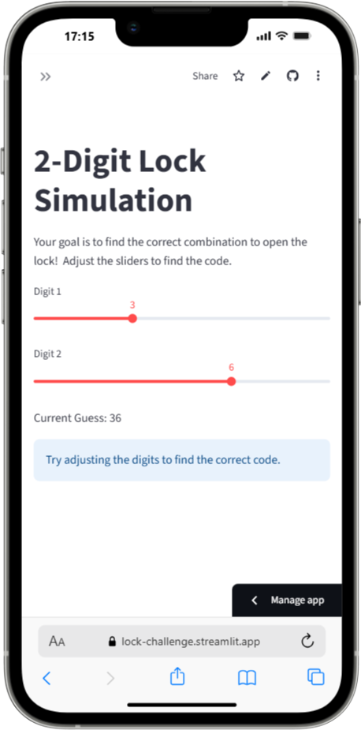

# 2-Digit Lock Simulation

### Purpose:
This app challenges students to find the correct 2-digit lock combination by adjusting two sliders. It’s a fun way to explore trial and error and the concept of combinations.

[](https://binary-image.streamlit.app/)



### Key Features:
- **Interactive Simulation**: Use sliders to adjust the digits and guess the 2-digit code.
- **Feedback**: Provides real-time feedback on the current guess and success message when the correct code is found.
- **QR Code for Mobile Practice**: A QR code is generated, allowing students to scan and access the interactive challenge directly on their mobile devices.

### Concept:
This app simulates a simple 2-digit lock challenge, where students need to guess a secret 2-digit code (in this case, 27) by adjusting the sliders for two digits.

---

### How to Run It on Your Own Machine

1. Make sure Python 3.9 or higher is installed on your system.

2. Install dependencies:
   ```bash
   $ pip install -r requirements.txt
   ```

3. Run the app:

   ```
   $ streamlit run streamlit_app.py
   ```

---
### Customization
Modify the Secret Code: You can change the secret_code variable to any 2-digit number.
